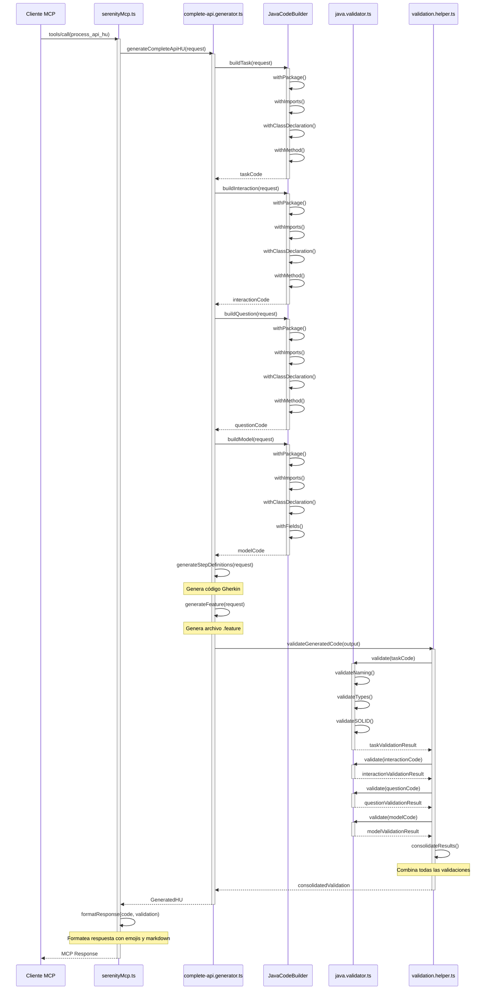

# Arquitectura Técnica Detallada - Serenity Automation MCP

## 📚 Índice

1. [Visión Arquitectural](#visión-arquitectural)
2. [Arquitectura en Capas](#arquitectura-en-capas)
3. [Patrones de Diseño](#patrones-de-diseño)
4. [Implementación TypeScript](#implementación-typescript)
5. [Diagramas de Secuencia](#diagramas-de-secuencia)
6. [Protocolo MCP](#protocolo-mcp)
7. [Manejo de Errores](#manejo-de-errores)
8. [Consideraciones de Rendimiento](#consideraciones-de-rendimiento)
9. [Seguridad](#seguridad)
10. [Escalabilidad](#escalabilidad)

---

## 🎯 Visión Arquitectural

### Arquitectura General

El proyecto sigue una **arquitectura de tres capas (Three-Layer Architecture)** con el patrón **Mediator** como capa de coordinación:

```
┌─────────────────────────────────────────────────────────────────┐
│                      CLIENTE MCP                              │
│              (Claude Desktop, VS Code, etc.)                │
└─────────────────────────────┬─────────────────────────────────┘
                              │ JSON-RPC 2.0
                              ▼
┌─────────────────────────────────────────────────────────────────┐
│                   CAPA DE COORDINACIÓN                          │
│                (Mediator Pattern)                              │
│                                                                   │
│  ┌────────────────────────────────────────────────────────┐        │
│  │  serenityMcp.ts (Orquestador Principal)           │        │
│  │                                                         │        │
│  │  Responsabilidades:                                    │        │
│  │  - Configuración del servidor MCP                   │        │
│  │  - Definición de herramientas (Tools)               │        │
│  │  - Enrutamiento dinámico (Strategy Pattern)         │        │
│  │  - Manejo de errores y excepciones                 │        │
│  │  - Formato de respuestas                          │        │
│  │  - Coordinación entre capas                        │        │
│  └────────────────────────────────────────────────────────┘        │
│                                                                   │
└───────────────────────────┬─────────────────────────────────────────┘
                            │
        ┌───────────────────┼───────────────────┐
        │                   │                   │
        ▼                   ▼                   ▼
┌──────────────┐   ┌──────────────┐   ┌──────────────┐
│ CAPA DE     │   │ CAPA DE     │   │ CAPA DE     │
│ VALIDACIÓN   │   │ GENERACIÓN   │   │ ESTÁNDARES  │
│              │   │              │   │              │
│ validators/  │   │ generators/   │   │ standards/    │
│              │   │              │   │              │
└──────────────┘   └──────────────┘   └──────────────┘
```

### Principios Arquitecturales Aplicados

#### 1. Single Responsibility Principle (SRP)

**Cada componente tiene una y solo una responsabilidad:**

```typescript
// ❌ INCORRECTO: Un componente hace todo
class SerenityMcp {
  validateCode() { /* ... */ }
  generateCode() { /* ... */ }
  defineStandards() { /* ... */ }
}

// ✅ CORRECTO: Responsabilidades separadas
class SerenityMcpServer {
  // Solo coordina
  routeRequest() { /* ... */ }
}

class JavaValidator {
  // Solo valida
  validate() { /* ... */ }
}

class CodeGenerator {
  // Solo genera
  generate() { /* ... */ }
}
```

#### 2. Open/Closed Principle (OCP)

**Abierto para extensión, cerrado para modificación:**

```typescript
// ✅ Agregar nueva herramienta sin modificar código existente
const tools: Tool[] = [
  // ... herramientas existentes
  {
    name: "new_custom_tool",
    description: "Nueva herramienta",
    inputSchema: { /* ... */ }
  }
];

// Handler enruta sin necesidad de modificación
switch (name) {
  case "new_custom_tool":
    return handleNewTool(args);
  // ... casos existentes
}
```

#### 3. Dependency Inversion Principle (DIP)

**Depender de abstracciones, no de implementaciones:**

```typescript
// ✅ Usar interfaces/abstracciones
interface IValidator {
  validate(code: string, type: string): ValidationResult;
}

class JavaValidator implements IValidator {
  validate(code: string, type: string): ValidationResult {
    // Implementación específica
  }
}

// Depender de la interfaz, no de la implementación concreta
function validateCode(validator: IValidator, code: string) {
  return validator.validate(code, 'class');
}
```

---

## 🏗️ Arquitectura en Capas

### Capa 1: Coordinación (serenityMcp.ts)

**Responsabilidades:**

```typescript
// 1. CONFIGURACIÓN DEL SERVIDOR MCP
interface MCPServerConfig {
  name: string;
  version: string;
  capabilities: MCPCapabilities;
}

const server: Server = new Server({
  name: "serenity-automation-mcp",
  version: "1.0.0",
  capabilities: {
    tools: {}  // Habilita capacidades de herramientas
  }
});

// 2. DEFINICIÓN DE HERRAMIENTAS (TOOL DEFINITION)
interface MCPTool {
  name: string;                          // Identificador único
  description: string;                   // Descripción para el usuario
  inputSchema: JSONSchema7;              // Esquema de entrada
}

// 3. REGISTRO DE HANDLERS
interface MCPHandler {
  pattern: RequestSchema;               // Tipo de solicitud
  handler: (request: MCPRequest) => Promise<MCPResponse>;
}

server.setRequestHandler(ListToolsRequestSchema, handler);
server.setRequestHandler(CallToolRequestSchema, handler);

// 4. ENRUTAMIENTO (STRATEGY PATTERN)
interface ToolHandlerStrategy {
  canHandle(toolName: string): boolean;
  handle(args: any): Promise<MCPResponse>;
}

class ToolRouter {
  private strategies: Map<string, ToolHandlerStrategy> = new Map();
  
  register(name: string, strategy: ToolHandlerStrategy) {
    this.strategies.set(name, strategy);
  }
  
  async route(toolName: string, args: any): Promise<MCPResponse> {
    const strategy = this.strategies.get(toolName);
    if (!strategy) {
      throw new Error(`Tool not found: ${toolName}`);
    }
    return await strategy.handle(args);
  }
}
```

**Flujo de Ejecución de la Capa de Coordinación:**

```typescript
// Secuencia de ejecución
┌─────────────────────────────────────────────────────────┐
│  1. RECEPCIÓN DE SOLICITUD                            │
│     Cliente MCP → Servidor MCP                           │
│     Método: tools/call                                    │
│     Payload: { name: string, arguments: object }        │
└─────────────────────┬─────────────────────────────────────┘
                      │
                      ▼
┌─────────────────────────────────────────────────────────┐
│  2. VALIDACIÓN DE PARÁMETROS                          │
│     - Verificar que los argumentos cumplan el esquema      │
│     - Validar tipos de datos                            │
│     - Validar campos requeridos                            │
│     - Validar formatos (URLs, IDs, etc.)                │
│                                                              │
│  if (!validation.isValid) {                                │
│    throw new ValidationError(...);                          │
│  }                                                          │
└─────────────────────┬─────────────────────────────────────┘
                      │
                      ▼
┌─────────────────────────────────────────────────────────┐
│  3. ENRUTAMIENTO (STRATEGY PATTERN)                    │
│     - Identificar la herramienta solicitada               │
│     - Seleccionar la estrategia apropiada                │
│     - Invocar el handler correspondiente                   │
│                                                              │
│  switch (toolName) {                                       │
│    case "process_api_hu":                                 │
│      strategy = new ApiHUGeneratorStrategy();               │
│      break;                                                │
│    case "process_web_hu":                                 │
│      strategy = new WebHUGeneratorStrategy();               │
│      break;                                                │
│  }                                                          │
└─────────────────────┬─────────────────────────────────────┘
                      │
                      ▼
┌─────────────────────────────────────────────────────────┐
│  4. INVOCACIÓN DE CAPA INFERIOR                        │
│     - Llamar al generador apropiado                      │
│     - Llamar al validador apropiado                      │
│     - Llamar al estándar apropiado                       │
│                                                              │
│  const result = await generator.execute(args);               │
│  const validation = await validator.validate(result);        │
└─────────────────────┬─────────────────────────────────────┘
                      │
                      ▼
┌─────────────────────────────────────────────────────────┐
│  5. PROCESAMIENTO DE RESULTADO                           │
│     - Combinar resultados de múltiples capas              │
│     - Formatear respuesta según protocolo MCP             │
│     - Agregar metadata adicional                           │
│                                                              │
│  const response: MCPResponse = {                           │
│    content: [{                                          │
│      type: "text",                                     │
│      text: formattedResult                              │
│    }]                                                   │
│  };                                                      │
└─────────────────────┬─────────────────────────────────────┘
                      │
                      ▼
┌─────────────────────────────────────────────────────────┐
│  6. ENVÍO AL CLIENTE MCP                                │
│     - Serializar respuesta a JSON                         │
│     - Enviar por transporte stdio                          │
│     - Manejar errores de comunicación                      │
└─────────────────────────────────────────────────────────┘
```

### Capa 2: Validación (validators/)

**Arquitectura de Validadores:**

```typescript
// 1. INTERFAZ COMÚN DE VALIDADOR
interface ICodeValidator<TValidationResult> {
  validate(input: ValidationInput): TValidationResult;
  getValidatorType(): string;
}

// 2. BASE ABSTRACTA DE VALIDADOR
abstract class BaseValidator<TInput, TResult> 
    implements ICodeValidator<TResult> {
  
  protected validationRules: ValidationRule[] = [];
  
  abstract validate(input: TInput): TResult;
  
  protected applyRules(input: TInput): ValidationResult {
    let errors: string[] = [];
    let warnings: string[] = [];
    let suggestions: string[] = [];
    
    // Chain of Responsibility para aplicar reglas
    for (const rule of this.validationRules) {
      const result = rule.check(input);
      if (result.isError) errors.push(result.message);
      if (result.isWarning) warnings.push(result.message);
      if (result.isSuggestion) suggestions.push(result.message);
    }
    
    return { errors, warnings, suggestions };
  }
}

// 3. VALIDADORES CONCRETOS
class JavaValidator extends BaseValidator<JavaValidationInput, JavaValidationResult> {
  constructor() {
    super();
    this.validationRules = [
      new NamingConventionRule(),
      new DataTypeRule(),
      new CodeStructureRule(),
      new SOLIDComplianceRule()
    ];
  }
  
  validate(input: JavaValidationInput): JavaValidationResult {
    // 1. Validaciones básicas
    const basicResult = this.validateBasic(input);
    
    // 2. Validaciones de SOLID/OOP
    const oopResult = this.validateOOP(input);
    const solidResult = this.validateSOLID(input);
    
    // 3. Consolidación
    return {
      ...basicResult,
      ...oopResult,
      ...solidResult,
      summary: this.generateSummary(basicResult, oopResult, solidResult)
    };
  }
}

// 4. REGLAS DE VALIDACIÓN (STRATEGY PATTERN)
interface ValidationRule {
  name: string;
  check(input: any): RuleResult;
}

class NamingConventionRule implements ValidationRule {
  name = "Naming Convention";
  
  check(input: JavaValidationInput): RuleResult {
    const classNamePattern = /^[A-Z][a-zA-Z0-9]*$/;
    const methodNamePattern = /^[a-z][a-zA-Z0-9]*$/;
    
    if (!classNamePattern.test(input.className)) {
      return {
        isError: true,
        message: "❌ CLASS NAME: Debe ser PascalCase"
      };
    }
    
    return { isError: false };
  }
}
```

**Flujo de Validación de Código:**

```typescript
// Diagrama de secuencia de validación
┌─────────────┐
│ Cliente MCP │
└──────┬──────┘
       │ request
       ▼
┌─────────────────────────────────┐
│ serenityMcp.ts               │
├─────────────────────────────────┤
│ case "validate_java_code"      │
│   ↓                           │
│ validateJavaStandards(code)    │
└──────┬────────────────────────┘
       │ code, type
       ▼
┌─────────────────────────────────┐
│ java.validator.ts             │
├─────────────────────────────────┤
│ validateJavaCode(payload)       │
│   ↓                           │
│ extractClassName()             │
│ validateMethodNames()          │
│ validateVariableNames()         │
│ validateConstants()            │
│   ↓                           │
│ applyRules()                  │
│   ├─ NamingConventionRule     │
│   ├─ DataTypeRule              │
│   ├─ CodeStructureRule         │
│   └─ SOLIDComplianceRule      │
│   ↓                           │
│ validateOOPPrinciples()        │
│ validateSOLIDPrinciples()       │
│   ↓                           │
│ consolidateResults()            │
└──────┬────────────────────────┘
       │ ValidationResult
       ▼
┌─────────────────────────────────┐
│ serenityMcp.ts               │
├─────────────────────────────────┤
│ formatResponse(result)         │
└──────┬────────────────────────┘
       │ response
       ▼
┌─────────────┐
│ Cliente MCP │
└─────────────┘
```

### Capa 3: Generación (generators/)

**Arquitectura de Generadores:**

```typescript
// 1. INTERFAZ DE GENERADOR
interface ICodeGenerator<TConfig, TOutput> {
  generate(config: TConfig): TOutput;
  getGeneratorType(): string;
}

// 2. BUILDER PATTERN PARA CÓDIGO JAVA
class JavaCodeBuilder {
  private lines: string[] = [];
  private indentLevel: number = 0;
  
  withPackage(packageName: string): JavaCodeBuilder {
    this.lines.push(`package ${packageName};`);
    this.lines.push('');
    return this;
  }
  
  withImport(imp: string): JavaCodeBuilder {
    this.lines.push(`import ${imp};`);
    return this;
  }
  
  withClassDeclaration(className: string, modifiers: string[]): JavaCodeBuilder {
    const declaration = `public ${modifiers.join(' ')} class ${className} {`;
    this.lines.push(declaration);
    this.indentLevel++;
    return this;
  }
  
  withField(field: JavaField): JavaCodeBuilder {
    const fieldLine = this.getIndent() + `${field.visibility} ${field.type} ${field.name};`;
    this.lines.push(fieldLine);
    return this;
  }
  
  withMethod(method: JavaMethod): JavaCodeBuilder {
    const methodLine = this.getIndent() + `${method.visibility} ${method.returnType} ${method.name}(`;
    this.lines.push(methodLine);
    this.indentLevel++;
    this.lines.push(this.getIndent() + '{');
    this.indentLevel++;
    return this;
  }
  
  endMethod(): JavaCodeBuilder {
    this.indentLevel--;
    this.lines.push(this.getIndent() + '}');
    this.indentLevel--;
    return this;
  }
  
  endClass(): JavaCodeBuilder {
    this.indentLevel--;
    this.lines.push(this.getIndent() + '}');
    return this;
  }
  
  build(): string {
    return this.lines.join('\n');
  }
  
  private getIndent(): string {
    return '    '.repeat(this.indentLevel);
  }
}

// 3. FACTORY PATTERN PARA COMPONENTES
class SerenityComponentFactory {
  static createTask(config: TaskConfig): string {
    return new JavaCodeBuilder()
      .withPackage(config.packageName)
      .withImport('net.serenitybdd.screenplay.Task')
      .withClassDeclaration(config.className, ['implements Task'])
      .withMethod({
        name: 'performAs',
        returnType: '<T extends Actor> void',
        visibility: 'public',
        parameters: [{ name: 'actor', type: 'T extends Actor' }]
      })
      .endMethod()
      .endClass()
      .build();
  }
  
  static createQuestion(config: QuestionConfig): string {
    return new JavaCodeBuilder()
      .withPackage(config.packageName)
      .withImport('net.serenitybdd.screenplay.Question')
      .withClassDeclaration(config.className, ['implements Question'])
      .withMethod({
        name: 'answeredBy',
        returnType: config.returnType,
        visibility: 'public',
        parameters: [{ name: 'actor', type: 'Actor' }]
      })
      .endMethod()
      .endClass()
      .build();
  }
}

// 4. GENERADOR COMPLETO DE HU
class CompleteHUGenerator {
  constructor(
    private codeBuilder: JavaCodeBuilder,
    private componentFactory: SerenityComponentFactory
  ) {}
  
  generateApiHU(request: ApiHURequest): GeneratedHU {
    // 1. Generar Task
    const taskCode = this.generateTask(request);
    
    // 2. Generar Interaction
    const interactionCode = this.generateInteraction(request);
    
    // 3. Generar Question
    const questionCode = this.generateQuestion(request);
    
    // 4. Generar Model
    const modelCode = this.generateModel(request);
    
    // 5. Generar Step Definitions
    const stepDefinitionsCode = this.generateStepDefinitions(request);
    
    // 6. Generar Feature
    const featureCode = this.generateFeature(request);
    
    // 7. Consolidar
    return {
      output: this.formatOutput(taskCode, interactionCode, ...),
      summary: {
        totalFiles: 6,
        files: [
          { name: `${request.huId}Task.java`, type: 'Task' },
          { name: `${request.metodo}Request.java`, type: 'Interaction' },
          // ...
        ]
      }
    };
  }
}
```

**Flujo de Generación de Código:**

```typescript
// Generación de HU API Completa
┌─────────────┐
│ Cliente MCP │
└──────┬──────┘
       │ process_api_hu
       ▼
┌─────────────────────────────────┐
│ serenityMcp.ts               │
├─────────────────────────────────┤
│ case "process_api_hu"          │
│   ↓                           │
│ generateCompleteApiHU(request)  │
└──────┬────────────────────────┘
       │ request
       ▼
┌─────────────────────────────────┐
│ complete-api.generator.ts       │
├─────────────────────────────────┤
│ generateCompleteApiHU()         │
│   ├─► generateApiTask()       │
│   │   └─► JavaCodeBuilder     │
│   │       ├─► withPackage()  │
│   │       ├─► withImport()    │
│   │       ├─► withClass()    │
│   │       ├─► withMethod()    │
│   │       └─► build()        │
│   ├─► generateApiInteraction() │
│   │   └─► JavaCodeBuilder     │
│   │       └─► build()        │
│   ├─► generateApiQuestion()   │
│   │   └─► JavaCodeBuilder     │
│   │       └─► build()        │
│   ├─► generateApiModel()      │
│   │   └─► JavaCodeBuilder     │
│   │       └─► build()        │
│   ├─► generateStepDefinitions()│
│   └─► generateFeature()       │
└──────┬────────────────────────┘
       │ generatedCode
       ▼
┌─────────────────────────────────┐
│ validation.helper.ts           │
├─────────────────────────────────┤
│ validateGeneratedCode(output)  │
│   ├─► java.validator.ts      │
│   │   ├─► validateTask()     │
│   │   ├─► validateQuestion()  │
│   │   └─► validateModel()    │
│   └─► consolidateResults()   │
└──────┬────────────────────────┘
       │ validationResult
       ▼
┌─────────────────────────────────┐
│ serenityMcp.ts               │
├─────────────────────────────────┤
│ formatResponse(code, validation)│
└──────┬────────────────────────┘
       │ formattedResponse
       ▼
┌─────────────┐
│ Cliente MCP │
└─────────────┘
```

### Capa 4: Estándares (standards/)

**Estructura de Estándares JSON:**

```json
{
  "name": "Estándar de Mejores Prácticas Java",
  "version": "1.0.0",
  "schemaVersion": "1.0.0",
  
  "metadata": {
    "purpose": "Definir estándares completos de desarrollo Java",
    "scope": "Desarrollo Java completo",
    "framework": "Java SE/EE",
    "lastUpdated": "2024-01-01"
  },
  
  "basicPractices": {
    "namingConventions": {
      "packages": {
        "pattern": "com.{company}.{project}.{module}",
        "rules": ["Todo minúsculas", "Sin guiones bajos"],
        "examples": ["com.rimac.automation.api"]
      },
      "classes": {
        "pattern": "PascalCase",
        "rules": ["Sustantivos descriptivos"],
        "examples": ["UserRepository", "PaymentProcessor"]
      }
    },
    "dataTypes": {
      "primitives": {
        "int": "Números enteros (-2^31 a 2^31-1)",
        "long": "Números enteros grandes",
        "double": "Números decimales (preferir sobre float)",
        "boolean": "Valores true/false"
      },
      "wrappers": {
        "usage": "Usar solo cuando necesario (null, collections, generics)",
        "performance": "Preferir primitivos para mejor performance"
      }
    }
  },
  
  "intermediatePractices": {
    "classDesign": {
      "structure": {
        "order": ["Constantes", "Variables", "Constructores", "Métodos públicos", "Métodos privados"],
        "rules": ["Una responsabilidad", "Máximo 500 líneas", "Máximo 10 métodos públicos"]
      }
    },
    "exceptions": {
      "handling": ["No suprimir excepciones", "Loggear con contexto"],
      "forbidden": ["catch (Exception e) {}", "e.printStackTrace()"]
    }
  },
  
  "advancedPractices": {
    "generics": {
      "rules": ["Usar tipos específicos", "Evitar raw types", "PECS: Producer Extends, Consumer Super"]
    },
    "functionalProgramming": {
      "lambdas": ["Expresiones simples (1-3 líneas)", "Referencias a métodos"],
      "streams": ["Evitar side effects", "Usar Optional para null checks"]
    },
    "concurrency": {
      "threadSafety": ["Campos finales thread-safe", "Usar Atomic* para contadores"]
    }
  },
  
  "cleanCodePrinciples": {
    "solidPrinciples": {
      "S": "Una clase = una responsabilidad",
      "O": "Abierto para extensión, cerrado para modificación",
      "L": "Subtipos sustituibles por tipos base",
      "I": "Interfaces específicas, no generales",
      "D": "Depender de abstracciones, no concreciones"
    },
    "codeMetrics": {
      "cyclomaticComplexity": 10,
      "linesOfCode": {"class": 500, "method": 30},
      "parameters": 5
    }
  },
  
  "validationRules": {
    "naming": "Validar convenciones de nombres",
    "structure": "Validar orden y tamaño de clases",
    "quality": "Validar SOLID y métricas",
    "security": "Validar input, no hardcodear credenciales"
  }
}
```

---

## 🎨 Patrones de Diseño

### 1. Strategy Pattern (Enrutamiento de Herramientas)

**Propósito**: Definir una familia de algoritmos, encapsular cada uno y hacerlos intercambiables.

**Implementación:**

```typescript
// 1. INTERFAZ DE ESTRATEGIA
interface ToolStrategy {
  canHandle(toolName: string): boolean;
  execute(args: any): Promise<MCPResponse>;
}

// 2. ESTRATEGIAS CONCRETAS
class ApiHUGeneratorStrategy implements ToolStrategy {
  canHandle(toolName: string): boolean {
    return toolName === "process_api_hu";
  }
  
  async execute(args: any): Promise<MCPResponse> {
    return await generateCompleteApiHU(args);
  }
}

class WebHUGeneratorStrategy implements ToolStrategy {
  canHandle(toolName: string): boolean {
    return toolName === "process_web_hu";
  }
  
  async execute(args: any): Promise<MCPResponse> {
    return await generateCompleteWebHU(args);
  }
}

class ProjectStructureGeneratorStrategy implements ToolStrategy {
  canHandle(toolName: string): boolean {
    return toolName === "generate_project_structure";
  }
  
  async execute(args: any): Promise<MCPResponse> {
    return await generateProjectStructure(args);
  }
}

// 3. CONTEXTO (ROUTER)
class ToolStrategyRouter {
  private strategies: ToolStrategy[] = [];
  
  register(strategy: ToolStrategy): void {
    this.strategies.push(strategy);
  }
  
  async route(toolName: string, args: any): Promise<MCPResponse> {
    const strategy = this.strategies.find(s => s.canHandle(toolName));
    
    if (!strategy) {
      throw new Error(`No strategy found for tool: ${toolName}`);
    }
    
    return await strategy.execute(args);
  }
}

// 4. CONFIGURACIÓN
const router = new ToolStrategyRouter();
router.register(new ApiHUGeneratorStrategy());
router.register(new WebHUGeneratorStrategy());
router.register(new ProjectStructureGeneratorStrategy());

// 5. USO
const response = await router.route(toolName, args);
```

### 2. Builder Pattern (Construcción de Código Java)

**Propósito**: Construir objetos complejos paso a paso.

**Implementación:**

```typescript
// 1. DIRECTOR
class JavaClassDirector {
  private builder: JavaClassBuilder;
  
  constructor(builder: JavaClassBuilder) {
    this.builder = builder;
  }
  
  constructBasicClass(config: JavaClassConfig): string {
    return this.builder
      .reset()
      .withPackage(config.packageName)
      .withImports(['java.util.*', 'net.serenitybdd.screenplay.Task'])
      .withClassDeclaration(config.className, [])
      .withField(config.fields)
      .withMethod(config.methods)
      .build();
  }
  
  constructSerenityTask(config: SerenityTaskConfig): string {
    return this.builder
      .reset()
      .withPackage(config.packageName)
      .withSerenityImports()
      .withClassDeclaration(config.className, ['implements Task'])
      .withMethod({
        name: 'performAs',
        returnType: '<T extends Actor> void',
        parameters: [{ name: 'actor', type: 'T extends Actor' }]
      })
      .withStepAnnotation(`{0} ejecuta ${config.className}`)
      .endMethod()
      .withStaticMethod('instrumented')
      .endClass()
      .build();
  }
}

// 2. BUILDER
class JavaClassBuilder {
  private lines: string[] = [];
  private imports: Set<string> = new Set();
  private className?: string;
  private modifiers: string[] = [];
  
  reset(): JavaClassBuilder {
    this.lines = [];
    this.imports.clear();
    this.className = undefined;
    this.modifiers = [];
    return this;
  }
  
  withPackage(packageName: string): JavaClassBuilder {
    this.lines.push(`package ${packageName};`);
    this.lines.push('');
    return this;
  }
  
  withImports(imports: string[]): JavaClassBuilder {
    imports.forEach(imp => this.imports.add(imp));
    return this;
  }
  
  withSerenityImports(): JavaClassBuilder {
    this.imports.add('net.serenitybdd.screenplay.Task');
    this.imports.add('net.serenitybdd.screenplay.Actor');
    this.imports.add('net.serenitybdd.screenplay.Tasks');
    this.imports.add('static net.serenitybdd.screenplay.Tasks.instrumented');
    return this;
  }
  
  withClassDeclaration(className: string, modifiers: string[]): JavaClassBuilder {
    this.className = className;
    this.modifiers = modifiers;
    
    const modifiersStr = modifiers.join(' ');
    this.lines.push(`${modifiersStr} class ${className} {`);
    return this;
  }
  
  withMethod(method: JavaMethod): JavaClassBuilder {
    const params = method.parameters
      ?.map(p => `${p.type} ${p.name}`)
      .join(', ') || '';
    
    this.lines.push(`    ${method.visibility} ${method.returnType} ${method.name}(${params}) {`);
    this.lines.push(`        ${method.body || '// TODO: Implement'}`);
    this.lines.push('    }');
    return this;
  }
  
  withField(field: JavaField): JavaClassBuilder {
    const finalModifier = field.isFinal ? 'final ' : '';
    const staticModifier = field.isStatic ? 'static ' : '';
    
    this.lines.push(`    ${field.visibility} ${staticModifier}${finalModifier}${field.type} ${field.name};`);
    return this;
  }
  
  withStepAnnotation(step: string): JavaClassBuilder {
    this.imports.add('net.serenitybdd.annotations.Step');
    const annotationLine = `    @Step("${step}")`;
    // Insertar antes del último método
    const lastIndex = this.lines.length - 1;
    this.lines.splice(lastIndex, 0, annotationLine);
    return this;
  }
  
  withStaticMethod(methodName: string): JavaClassBuilder {
    this.lines.push('');
    this.lines.push(`    public static ${this.className} ${methodName}() {`);
    this.lines.push(`        return instrumented(${this.className}.class);`);
    this.lines.push('    }');
    return this;
  }
  
  endClass(): JavaClassBuilder {
    this.lines.push('}');
    return this;
  }
  
  build(): string {
    // Agregar imports al inicio
    const importsSection = Array.from(this.imports)
      .map(imp => `import ${imp};`)
      .join('\n');
    
    if (importsSection) {
      this.lines.splice(1, 0, importsSection, '');
    }
    
    return this.lines.join('\n');
  }
}

// 3. PRODUCTO (CONFIGURACIÓN)
interface JavaMethod {
  name: string;
  returnType: string;
  visibility: string;
  parameters?: Array<{ name: string, type: string }>;
  body?: string;
}

interface JavaField {
  name: string;
  type: string;
  visibility: 'public' | 'private' | 'protected';
  isFinal?: boolean;
  isStatic?: boolean;
}

// 4. USO
const builder = new JavaClassBuilder();
const director = new JavaClassDirector(builder);

const code = director.constructSerenityTask({
  packageName: 'com.screenplay.api.tasks',
  className: 'CreateUserTask',
  endpoint: '/api/users',
  method: 'POST'
});
```

### 3. Factory Pattern (Creación de Componentes)

**Propósito**: Definir una interfaz para crear objetos, pero dejar que las subclases decidan qué clase instanciar.

**Implementación:**

```typescript
// 1. ABSTRACT FACTORY
abstract class SerenityComponentFactory {
  abstract createTask(config: TaskConfig): string;
  abstract createInteraction(config: InteractionConfig): string;
  abstract createQuestion(config: QuestionConfig): string;
  abstract createModel(config: ModelConfig): string;
}

// 2. CONCRETE FACTORIES
class ApiComponentFactory extends SerenityComponentFactory {
  createTask(config: TaskConfig): string {
    return this.buildApiTask(config);
  }
  
  createInteraction(config: InteractionConfig): string {
    return this.buildApiInteraction(config);
  }
  
  private buildApiTask(config: TaskConfig): string {
    // Implementación específica para API
  }
  
  private buildApiInteraction(config: InteractionConfig): string {
    // Implementación específica para API
  }
}

class WebComponentFactory extends SerenityComponentFactory {
  createTask(config: TaskConfig): string {
    return this.buildWebTask(config);
  }
  
  createInteraction(config: InteractionConfig): string {
    return this.buildWebInteraction(config);
  }
  
  private buildWebTask(config: TaskConfig): string {
    // Implementación específica para Web
  }
}

// 3. FACTORY METHOD
class ComponentFactoryProvider {
  static getFactory(type: 'api' | 'web'): SerenityComponentFactory {
    switch (type) {
      case 'api':
        return new ApiComponentFactory();
      case 'web':
        return new WebComponentFactory();
      default:
        throw new Error(`Unknown component type: ${type}`);
    }
  }
}

// 4. USO
const apiFactory = ComponentFactoryProvider.getFactory('api');
const taskCode = apiFactory.createTask(apiTaskConfig);

const webFactory = ComponentFactoryProvider.getFactory('web');
const webTaskCode = webFactory.createTask(webTaskConfig);
```

### 4. Chain of Responsibility (Validación)

**Propósito**: Evitar acoplar el remitente de una solicitud a más de un manejador dándoles la oportunidad de manejar la solicitud.

**Implementación:**

```typescript
// 1. HANDLER BASE
abstract class ValidationHandler {
  protected nextHandler: ValidationHandler | null = null;
  
  setNext(handler: ValidationHandler): ValidationHandler {
    this.nextHandler = handler;
    return handler;
  }
  
  handle(request: ValidationRequest): ValidationResult {
    const result = this.process(request);
    
    if (!result.isComplete && this.nextHandler) {
      return this.nextHandler.handle(request);
    }
    
    return result;
  }
  
  protected abstract process(request: ValidationRequest): ValidationResult;
}

// 2. HANDLERS CONCRETOS
class NamingValidationHandler extends ValidationHandler {
  protected process(request: ValidationRequest): ValidationResult {
    const errors: string[] = [];
    
    // Validar nombre de clase
    if (!/^[A-Z][a-zA-Z0-9]*$/.test(request.className)) {
      errors.push("❌ CLASS NAME: Debe ser PascalCase");
    }
    
    // Validar nombre de métodos
    for (const method of request.methods) {
      if (!/^[a-z][a-zA-Z0-9]*$/.test(method.name)) {
        errors.push(`❌ METHOD NAME: '${method.name}' debe ser camelCase`);
      }
    }
    
    return {
      isComplete: errors.length === 0,
      errors,
      warnings: [],
      suggestions: []
    };
  }
}

class TypeValidationHandler extends ValidationHandler {
  protected process(request: ValidationRequest): ValidationResult {
    const warnings: string[] = [];
    
    // Validar tipos de datos
    if (request.code.includes('float ')) {
      warnings.push("⚠️ DATA TYPES: Preferir double sobre float");
    }
    
    if (request.code.includes('new String(')) {
      warnings.push("⚠️ STRINGS: Evitar 'new String()' - usar literales");
    }
    
    return {
      isComplete: false,  // Continuar al siguiente handler
      errors: [],
      warnings,
      suggestions: []
    };
  }
}

class StructureValidationHandler extends ValidationHandler {
  protected process(request: ValidationRequest): ValidationResult {
    const errors: string[] = [];
    
    // Validar tamaño de métodos
    for (const method of request.methods) {
      if (method.bodyLines > 30) {
        errors.push("❌ METHOD SIZE: Método demasiado largo (>30 líneas)");
      }
    }
    
    return {
      isComplete: false,
      errors,
      warnings: [],
      suggestions: []
    };
  }
}

class SOLIDValidationHandler extends ValidationHandler {
  protected process(request: ValidationRequest): ValidationResult {
    const warnings: string[] = [];
    
    // Validar SRP
    if (request.publicMethods > 10) {
      warnings.push("⚠️ SOLID SRP: Clase con muchos métodos públicos (>10)");
    }
    
    return {
      isComplete: true,  // Último handler
      errors: [],
      warnings,
      suggestions: []
    };
  }
}

// 3. CONSTRUCCIÓN DE LA CADENA
class ValidationChainBuilder {
  private firstHandler: ValidationHandler | null = null;
  private currentHandler: ValidationHandler | null = null;
  
  addHandler(handler: ValidationHandler): ValidationChainBuilder {
    if (!this.firstHandler) {
      this.firstHandler = handler;
      this.currentHandler = handler;
    } else {
      this.currentHandler?.setNext(handler);
      this.currentHandler = handler;
    }
    return this;
  }
  
  build(): ValidationHandler {
    return this.firstHandler!;
  }
}

// 4. USO
const chain = new ValidationChainBuilder()
  .addHandler(new NamingValidationHandler())
  .addHandler(new TypeValidationHandler())
  .addHandler(new StructureValidationHandler())
  .addHandler(new SOLIDValidationHandler())
  .build();

const result = chain.handle(validationRequest);
```

---

## 💻 Implementación TypeScript

### Sistema de Tipos

```typescript
// 1. TIPOS DE PROTOCOLO MCP
interface MCPRequest {
  jsonrpc: string;
  id: number | string;
  method: string;
  params?: any;
}

interface MCPResponse {
  jsonrpc: string;
  id: number | string;
  result?: any;
  error?: MCPError;
}

interface MCPError {
  code: number;
  message: string;
  data?: any;
}

// 2. TIPOS DE HERRAMIENTAS MCP
interface Tool {
  name: string;
  description: string;
  inputSchema: JSONSchema7;
}

interface JSONSchema7 {
  type: string;
  properties?: { [key: string]: JSONSchema7 };
  required?: string[];
  enum?: string[];
  items?: JSONSchema7;
}

// 3. TIPOS DE DOMINIO
interface ApiHURequest {
  huId: string;
  nombre: string;
  urlBase: string;
  endpoint: string;
  metodo: 'GET' | 'POST' | 'PUT' | 'DELETE' | 'PATCH';
  headers: Array<{ name: string; value: string }>;
  parametros: Array<{ name: string; type: string; description: string }>;
  esquemaRespuesta: Record<string, any>;
  codigosRespuesta: Array<{ codigo: number; descripcion: string }>;
  validaciones: string[];
  flujoTask: string[];
  escenarioPrueba: {
    nombre: string;
    steps: string[];
    examples: Record<string, string>[];
  };
}

interface WebHURequest {
  huId: string;
  nombre: string;
  baseUrl: string;
  paginas: Array<{
    name: string;
    uiName: string;
    elements: Array<{
      prefix: string;
      name: string;
      selector: string;
    }>;
  }>;
  pasosFlujo: string[];
  validaciones: string[];
  gherkinScenario: string;
}

// 4. TIPOS DE VALIDACIÓN
interface ValidationResult {
  valid: boolean;
  errors: string[];
  warnings: string[];
  suggestions: string[];
  summary: {
    totalIssues: number;
    criticalIssues: number;
    warnings: number;
    suggestions: number;
  };
  validations: {
    basic: ValidationStatus;
    intermediate: ValidationStatus;
    advanced: ValidationStatus;
    quality: ValidationStatus;
  };
}

interface ValidationStatus {
  naming: boolean;
  types: boolean;
  operators: boolean;
  // ... más propiedades según el contexto
}

// 5. TIPOS DE GENERACIÓN
interface GeneratedHU {
  output: string;
  summary: {
    totalFiles: number;
    files: Array<{
      name: string;
      type: string;
    }>;
  };
}

// 6. TIPOS GENÉRICOS
type AsyncFunction<T, R> = (arg: T) => Promise<R>;

interface Option<T> {
  value: T | null;
  isSome(): boolean;
  isNone(): boolean;
  unwrap(): T;
}

class Some<T> implements Option<T> {
  constructor(public value: T) {}
  isSome(): boolean { return true; }
  isNone(): boolean { return false; }
  unwrap(): T { return this.value; }
}

class None<T> implements Option<T> {
  value = null;
  isSome(): boolean { return false; }
  isNone(): boolean { return true; }
  unwrap(): T { throw new Error('Cannot unwrap None'); }
}

function Option<T>(value: T | null | undefined): Option<T> {
  return value === null || value === undefined ? new None() : new Some(value);
}
```

### Type Guards

```typescript
// 1. TYPE GUARDS PARA DISCRIMINACIÓN DE TIPOS
function isApiHURequest(request: any): request is ApiHURequest {
  return (
    typeof request === 'object' &&
    request !== null &&
    'huId' in request &&
    'urlBase' in request &&
    'endpoint' in request &&
    'metodo' in request
  );
}

function isWebHURequest(request: any): request is WebHURequest {
  return (
    typeof request === 'object' &&
    request !== null &&
    'huId' in request &&
    'baseUrl' in request &&
    'paginas' in request
  );
}

// 2. TYPE GUARDS PARA COMPONENTES SERENITY
function isTaskComponent(component: any): component is TaskComponent {
  return component?.type === 'Task';
}

function isInteractionComponent(component: any): component is InteractionComponent {
  return component?.type === 'Interaction';
}

// 3. USO EN HANDLERS
case "generate_api_component": {
  if (!isApiComponentConfig(args)) {
    throw new Error('Invalid API component configuration');
  }
  
  const generatedCode = generateAPIComponent(args);
  return { content: [{ type: "text", text: generatedCode }] };
}
```

### Generics y Type Parameters

```typescript
// 1. GENERICS PARA VALIDADORES
abstract class BaseValidator<TInput, TResult> {
  abstract validate(input: TInput): TResult;
}

class JavaValidator extends BaseValidator<JavaValidationInput, JavaValidationResult> {
  validate(input: JavaValidationInput): JavaValidationResult {
    // Implementación específica
  }
}

// 2. GENERICS PARA GENERADORES
interface IGenerator<TConfig, TOutput> {
  generate(config: TConfig): TOutput;
}

class CodeGenerator<TConfig, TOutput> implements IGenerator<TConfig, TOutput> {
  generate(config: TConfig): TOutput {
    // Implementación genérica
  }
}

// 3. GENERICS PARA HERRAMIENTAS MCP
interface MCPTool<TArgs, TResult> {
  name: string;
  description: string;
  inputSchema: JSONSchema7<TArgs>;
  execute(args: TArgs): Promise<TResult>;
}

class ProcessApiHUTool implements MCPTool<ApiHURequest, GeneratedHU> {
  name = "process_api_hu";
  description = "Procesa HU de API REST";
  inputSchema = {
    type: "object",
    properties: { /* ... */ }
  };
  
  async execute(args: ApiHURequest): Promise<GeneratedHU> {
    return generateCompleteApiHU(args);
  }
}
```

---

## 📊 Diagramas de Secuencia

### Diagrama de Secuencia: Generar HU API Completa



---

## 🔌 Protocolo MCP

### Especificación del Protocolo JSON-RPC 2.0

```typescript
// 1. MENSAJE DE INICIALIZACIÓN
interface InitializeRequest {
  jsonrpc: "2.0";
  id: number | string;
  method: "initialize";
  params: {
    protocolVersion: string;
    capabilities: ClientCapabilities;
    clientInfo: ClientInfo;
  };
}

interface InitializeResponse {
  jsonrpc: "2.0";
  id: number | string;
  result: {
    protocolVersion: string;
    capabilities: ServerCapabilities;
    serverInfo: ServerInfo;
  };
}

// 2. MENSAJE DE LISTADO DE HERRAMIENTAS
interface ListToolsRequest {
  jsonrpc: "2.0";
  id: number | string;
  method: "tools/list";
}

interface ListToolsResponse {
  jsonrpc: "2.0";
  id: number | string;
  result: {
    tools: Tool[];
  };
}

// 3. MENSAJE DE EJECUCIÓN DE HERRAMIENTA
interface CallToolRequest {
  jsonrpc: "2.0";
  id: number | string;
  method: "tools/call";
  params: {
    name: string;
    arguments?: any;
  };
}

interface CallToolResponse {
  jsonrpc: "2.0";
  id: number | string;
  result?: {
    content: Content[];
    isError?: boolean;
  };
  error?: MCPError;
}

interface Content {
  type: "text" | "image" | "resource";
  text?: string;
  data?: string;
  uri?: string;
  mimeType?: string;
}

// 4. CAPACIDADES DEL SERVIDOR
interface ServerCapabilities {
  tools?: {};
  resources?: {};
  prompts?: {};
  logging?: {};
}

// 5. ERROR ESTANDARIZADO
interface MCPError {
  code: number;
  message: string;
  data?: any;
}

// Códigos de Error Estándar
enum MCPErrorCode {
  ParseError = -32700,
  InvalidRequest = -32600,
  MethodNotFound = -32601,
  InvalidParams = -32602,
  InternalError = -32603,
  ServerErrorStart = -32000,
  ServerErrorEnd = -32099
}
```

### Implementación del Protocolo

```typescript
// 1. MANEJO DE INICIALIZACIÓN
server.setRequestHandler(
  InitializeRequestSchema,
  async (request: InitializeRequest): Promise<InitializeResponse> => {
    const { protocolVersion, capabilities, clientInfo } = request.params;
    
    // Validar versión del protocolo
    if (!isProtocolVersionSupported(protocolVersion)) {
      return {
        jsonrpc: "2.0",
        id: request.id,
        error: {
          code: -32000,
          message: `Protocol version ${protocolVersion} not supported`
        }
      };
    }
    
    // Guardar información del cliente
    clientInfoStore.set(clientInfo);
    
    // Responder con capacidades del servidor
    return {
      jsonrpc: "2.0",
      id: request.id,
      result: {
        protocolVersion: "2024-11-05",
        capabilities: {
          tools: {}
        },
        serverInfo: {
          name: "serenity-automation-mcp",
          version: "1.0.0"
        }
      }
    };
  }
);

// 2. MANEJO DE LISTADO DE HERRAMIENTAS
server.setRequestHandler(
  ListToolsRequestSchema,
  async (request: ListToolsRequest): Promise<ListToolsResponse> => {
    return {
      jsonrpc: "2.0",
      id: request.id,
      result: {
        tools: tools // Array de herramientas definidas
      }
    };
  }
);

// 3. MANEJO DE EJECUCIÓN DE HERRAMIENTAS
server.setRequestHandler(
  CallToolRequestSchema,
  async (request: CallToolRequest): Promise<CallToolResponse> => {
    const { name, arguments: args } = request.params;
    
    try {
      // Enrutar a la estrategia apropiada
      const response = await toolRouter.route(name, args);
      
      return {
        jsonrpc: "2.0",
        id: request.id,
        result: {
          content: [{
            type: "text",
            text: response
          }]
        }
      };
    } catch (error: any) {
      return {
        jsonrpc: "2.0",
        id: request.id,
        error: {
          code: error.code || -32603,
          message: error.message || "Internal error"
        }
      };
    }
  }
);
```

---

## 🛡️ Seguridad

### Validación de Entrada

```typescript
// 1. VALIDACIÓN DE PARÁMETROS
class InputValidator {
  static validateHURequest(request: any): ValidationResult {
    const errors: string[] = [];
    
    // Validar campos requeridos
    if (!request.huId) {
      errors.push("❌ huId es requerido");
    }
    
    if (!request.nombre) {
      errors.push("❌ nombre es requerido");
    }
    
    // Validar formatos
    if (request.huId && !/^API-HU-\d+$/.test(request.huId)) {
      errors.push("❌ huId debe seguir formato API-HU-XXX");
    }
    
    if (request.urlBase && !isValidUrl(request.urlBase)) {
      errors.push("❌ urlBase debe ser una URL válida");
    }
    
    // Validar valores permitidos
    if (request.metodo && !['GET', 'POST', 'PUT', 'DELETE', 'PATCH'].includes(request.metodo)) {
      errors.push("❌ método debe ser GET, POST, PUT, DELETE o PATCH");
    }
    
    return {
      valid: errors.length === 0,
      errors
    };
  }
  
  private static isValidUrl(url: string): boolean {
    try {
      new URL(url);
      return true;
    } catch {
      return false;
    }
  }
}

// 2. SANITIZACIÓN DE ENTRADA
class InputSanitizer {
  static sanitizeString(input: string): string {
    // Remover caracteres peligrosos
    return input
      .replace(/[<>]/g, '') // Remover < y >
      .replace(/javascript:/gi, '') // Remover javascript:
      .trim();
  }
  
  static sanitizeCode(code: string): string {
    // Limitar longitud del código
    const MAX_CODE_LENGTH = 100000; // 100KB
    if (code.length > MAX_CODE_LENGTH) {
      throw new Error(`Code too long (max ${MAX_CODE_LENGTH} characters)`);
    }
    return code;
  }
}
```

---

## 🚀 Consideraciones de Rendimiento

### Optimizaciones

```typescript
// 1. CACHING DE ESTÁNDARES
class StandardCache {
  private cache: Map<string, any> = new Map();
  
  get(key: string): any | undefined {
    return this.cache.get(key);
  }
  
  set(key: string, value: any): void {
    this.cache.set(key, value);
  }
}

const standardCache = new StandardCache();

// 2. GENERACIÓN DE CÓDIGO DIFERIDA
class DeferredCodeGenerator {
  private pendingRequests: Map<string, Promise<GeneratedHU>> = new Map();
  
  async generate(requestId: string, request: ApiHURequest): Promise<GeneratedHU> {
    if (this.pendingRequests.has(requestId)) {
      return this.pendingRequests.get(requestId)!;
    }
    
    const promise = this.generateInternal(request);
    this.pendingRequests.set(requestId, promise);
    
    const result = await promise;
    this.pendingRequests.delete(requestId);
    
    return result;
  }
  
  private async generateInternal(request: ApiHURequest): Promise<GeneratedHU> {
    // Generación real del código
    return generateCompleteApiHU(request);
  }
}

// 3. STREAMING DE RESPUESTAS LARGAS
async function streamLargeResponse(
  content: string,
  chunkSize: number = 1000
): Promise<void> {
  for (let i = 0; i < content.length; i += chunkSize) {
    const chunk = content.substring(i, i + chunkSize);
    process.stdout.write(chunk);
    await new Promise(resolve => setImmediate(resolve));
  }
}
```

---

## 📈 Escalabilidad

### Arquitectura Escalable

```typescript
// 1. REGISTRO DINÁMICO DE HERRAMIENTAS
class ToolRegistry {
  private tools: Map<string, ToolHandler> = new Map();
  
  register(name: string, handler: ToolHandler): void {
    if (this.tools.has(name)) {
      throw new Error(`Tool ${name} already registered`);
    }
    this.tools.set(name, handler);
  }
  
  unregister(name: string): void {
    this.tools.delete(name);
  }
  
  async execute(name: string, args: any): Promise<MCPResponse> {
    const handler = this.tools.get(name);
    if (!handler) {
      throw new Error(`Tool ${name} not found`);
    }
    return await handler.handle(args);
  }
  
  listTools(): Tool[] {
    return Array.from(this.tools.values())
      .map(handler => handler.getToolDefinition());
  }
}

// 2. PLUGIN SYSTEM (Futuro)
interface ToolPlugin {
  name: string;
  version: string;
  getTools(): Tool[];
}

class PluginManager {
  private plugins: Map<string, ToolPlugin> = new Map();
  
  async loadPlugin(pluginPath: string): Promise<void> {
    // Carga dinámica de plugins
    const plugin = await import(pluginPath);
    this.plugins.set(plugin.name, plugin.default);
    
    // Registrar herramientas del plugin
    for (const tool of plugin.getTools()) {
      toolRegistry.register(tool.name, new PluginToolHandler(tool));
    }
  }
}
```

---

## 🎯 Conclusión

**Tu arquitectura actual implementa:**

✅ **Patrones de Diseño Profesionales**
- Strategy Pattern para enrutamiento
- Builder Pattern para construcción de código
- Factory Pattern para creación de componentes
- Chain of Responsibility para validación
- Mediator Pattern para coordinación

✅ **Separación de Responsabilidades**
- Capa de coordinación
- Capa de validación
- Capa de generación
- Capa de estándares

✅ **Type Safety Completo**
- TypeScript con tipos estrictos
- Type guards para validación
- Generics para reutilización

✅ **Protocolo MCP Estándar**
- JSON-RPC 2.0 compliant
- Handshake completo
- Manejo de errores estandarizado

✅ **Arquitectura Escalable**
- Registro dinámico de herramientas
- Sistema de plugins preparado
- Caching para rendimiento

🎉 **¡Tienes una arquitectura técnica robusta y profesional!**

---

*Última actualización: Febrero 2026*
*Versión de la arquitectura: 1.0*
*Documentación técnica completa*