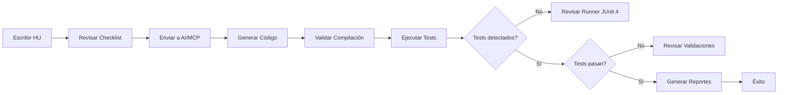

# 📖 Guía de Ejemplos - Historias de Usuario

## 🎯 Propósito de esta Guía

Esta guía contiene **ejemplos completos y plantillas** de cómo estructurar correctamente Historias de Usuario (HU) para automatización con Serenity BDD + Screenplay, asegurando que el código generado por AI/MCP sea correcto desde el inicio.

---

## 📂 Contenido

### 1. [📖 Ejemplo de Uso Correcto - Web](./EJEMPLO_USO_CORRECTO_WEB.md) ⭐ **NUEVO**
**Guía esencial sobre cómo usar correctamente la herramienta process_web_hu**

**Incluye:**
- ✅ Formato JSON correcto vs. texto libre (❌ incorrecto)
- ✅ Conversión paso a paso de texto a JSON
- ✅ Estructura completa del JSON explicada
- ✅ Tabla de prefijos de elementos (TXT, BTN, LBL, etc.)
- ✅ Estrategias de selectores (id, css, xpath)
- ✅ Ejemplo completo con SauceDemo
- ✅ Checklist de validación antes de enviar
- ✅ Soluciones a errores comunes

**Ideal para:**
- Resolver el error "input does not comply with allowed values"
- Entender qué formato espera la herramienta
- Convertir especificaciones de texto a JSON

---

### 2. [🚀 Guía Rápida API](./GUIA_RAPIDA_API.md) ⚡
**Referencia rápida con checklist y plantilla ultra-compacta**

**Incluye:**
- ✅ Checklist rápido de 14 puntos
- ✅ Plantilla ultra-rápida lista para copiar
- ✅ 5 reglas de oro para especificaciones perfectas
- ✅ Tabla de tipos de datos y códigos HTTP
- ✅ Semáforo de calidad (listo/revisar/no enviar)
- ✅ Soluciones a problemas comunes

**Ideal para:**
- Consulta rápida mientras escribes
- Validación antes de enviar
- Referencia de tipos y códigos HTTP

---

### 3. [📝 Plantilla de Especificación API](./PLANTILLA_ESPECIFICACION_API.md) ⭐
**Plantilla completa y fácil de usar para especificar HUs de API**

**Incluye:**
- ✅ Plantilla lista para copiar y completar
- ✅ Ejemplo completo basado en Rick and Morty API
- ✅ Checklist de calidad antes de enviar
- ✅ Tips para especificaciones perfectas
- ✅ Guía paso a paso de cómo usar la plantilla
- ✅ Secciones detalladas: Headers, Parámetros, Respuestas, Validaciones, Gherkin

**Ideal para:**
- Analistas QA que necesitan especificar HUs
- Equipos que trabajan con agentes AI/MCP
- Cualquiera que quiera una plantilla estructurada y completa

---

### 4. [Ejemplo HU API REST](./EJEMPLO_HU_API.md)
**Automatización de APIs REST con Serenity Screenplay**

**Incluye:**
- ✅ Estructura completa de una HU API
- ✅ Plantilla de solicitud con todos los campos necesarios
- ✅ Ejemplos por tipo de request (GET, POST, PUT, DELETE)
- ✅ Errores comunes y cómo evitarlos
- ✅ Checklist de calidad pre-envío
- ✅ Referencias técnicas y mejores prácticas

**Basado en:** Rick and Morty API - Documento de Solución de Problemas

**Casos de uso:**
- Pruebas de APIs REST públicas o privadas
- Validación de respuestas JSON
- Autenticación con tokens/API keys
- Pruebas de integración backend

---

### 5. [Ejemplo HU Web UI](./EJEMPLO_HU_WEB.md)
**Automatización de interfaces web con Serenity Screenplay + Selenium**

**Incluye:**
- ✅ Estructura completa de una HU Web
- ✅ Definición de elementos UI con locators
- ✅ Flujos de navegación paso a paso
- ✅ Ejemplos por tipo de interacción (Login, Forms, Navigation, Dynamic Content)
- ✅ Prefijos estándar para elementos (TXT_, BTN_, LBL_, etc.)
- ✅ Configuración de WebDriver y serenity.properties
- ✅ Patrones de interacción comunes

**Casos de uso:**
- Pruebas E2E de aplicaciones web
- Validación de flujos de usuario
- Testing de formularios y navegación
- Pruebas de responsive design

---

## 🚀 Cómo Usar Esta Guía

### Para Analistas / QA

1. **Lee el documento correspondiente** a tu tipo de HU (API o Web)
2. **Sigue la plantilla** proporcionada para estructurar tu HU
3. **Usa el checklist** para verificar que incluiste toda la información
4. **Revisa los errores comunes** para evitar problemas típicos
5. **Envía tu HU** con toda la información necesaria

### Para Desarrolladores / AI

1. **Valida** que la HU recibida incluya todos los campos requeridos
2. **Genera el código** siguiendo los estándares documentados
3. **Verifica** que la estructura generada coincida con los ejemplos
4. **Ejecuta** los comandos de validación (mvn clean test)
5. **Confirma** que las pruebas se detectan y ejecutan correctamente

---

## 🎓 Conceptos Clave

### JUnit 4 with Cucumber

**⚠️ IMPORTANTE**: Los proyectos generados usan **JUnit 4** con Cucumber para ejecutar los tests. 

El runner usa el patrón:
```java
@RunWith(CucumberWithSerenity.class)
@CucumberOptions(...)
public class CucumberTestRunner {}
```

**Nota técnica**: El proyecto incluye ambas versiones de JUnit como dependencias:
- JUnit 4 (4.13.2) es **requerido** para el runner de Cucumber: `@RunWith(CucumberWithSerenity.class)` 
- JUnit 5 (5.9.2) está incluido pero es opcional - puedes usarlo para tests unitarios adicionales si lo necesitas

### Separación de Responsabilidades

**Endpoints** → Solo paths relativos, NO URLs completas  
**Hooks** → Configura baseURL con `CallAnApi.at()`  
**Interactions** → HTTP simple, sin sobrecarga  
**Tasks** → Lenguaje de negocio  
**Questions** → Validaciones específicas  

---

## 📋 Plantillas Rápidas

### API REST (Mínimo Viable)

```
ID: API-HU-XXX
Título: [Acción sobre recurso]
Base URL: [https://api.example.com]
Endpoint: [/api/v1/resource/{id}]
Método: [GET/POST/PUT/DELETE]

Response esperado:
{
  "field1": [Type],
  "field2": [Type]
}

Validaciones:
- Status code [200/201/204]
- Campo 'field1' no debe estar vacío
- [Otras validaciones específicas]

Usando Serenity Screenplay con JUnit 4.
```

### Web UI (Mínimo Viable)

```
ID: WEB-HU-XXX
Título: [Acción del usuario]
URL: [https://www.example.com]

Páginas:
- [Nombre Página]:
  * TXT_[NOMBRE]: [locator_strategy]="[locator_value]"
  * BTN_[NOMBRE]: [locator_strategy]="[locator_value]"

Flujo:
1. [Paso 1]
2. [Paso 2]
...

Validaciones:
- [Validación visual/funcional 1]
- [Validación visual/funcional 2]

Usando Serenity Screenplay con Selenium WebDriver y JUnit 4.
```

---

## ⚠️ Problemas Comunes Resueltos

### 1. Tests no se detectan (Tests run: 0)
**Causa**: Runner mal configurado o dependencias incorrectas  
**Solución**: Asegúrate de usar `@RunWith(CucumberWithSerenity.class)` con las dependencias correctas de JUnit 4

### 2. URLs malformadas en peticiones
**Causa**: Duplicación de BASE_URL en endpoints  
**Solución**: Endpoints solo devuelven paths relativos

### 3. HTTP 403 Forbidden
**Causa**: Interacciones sobrecargadas con headers innecesarios  
**Solución**: Simplificar interacciones, eliminar contentType si no es necesario

### 4. No se generan reportes Serenity
**Causa**: Falta serenity-maven-plugin  
**Solución**: Agregar plugin y ejecutar `mvn clean verify`

### 5. Locators no encuentran elementos Web
**Causa**: Locators genéricos o incorrectos  
**Solución**: Usar locators específicos con IDs o CSS únicos

---

## 📚 Documentos Relacionados

- **serenity-api-screenplay.standard.json** - Estándar completo API
- **serenity-web-screenplay.standard.json** - Estándar completo Web  
- **Documento de Solución de Problemas** - Rick and Morty API (fuente original)
- **README.md** - Documentación del proyecto MCP

---

## 🔄 Proceso de Validación



---

## 💡 Mejores Prácticas

### Documentación de HU

1. ✅ **Sé específico**: "Status code 200" no "respuesta exitosa"
2. ✅ **Separa conceptos**: Base URL ≠ Endpoint path
3. ✅ **Incluye tipos**: "id: Integer" no solo "id"
4. ✅ **Documenta headers**: Si la API los requiere, especifícalos
5. ✅ **Usa ejemplos reales**: Datos de prueba verificables

### Generación de Código

1. ✅ **Valida siempre con**: `mvn clean compile` → `mvn clean test`
2. ✅ **Verifica que se detecten**: Tests run: X (X > 0)
3. ✅ **Genera reportes**: `mvn clean verify` para Serenity reports
4. ✅ **Usa logging verbose**: En desarrollo para debugging
5. ✅ **Simplifica interacciones**: Menos código = menos errores

### Mantenimiento

1. ✅ **Versionado consistente**: Usa `${serenity.version}` en pom.xml
2. ✅ **Usa el runner correcto**: Asegúrate de usar `@RunWith(CucumberWithSerenity.class)` con JUnit 4
3. ✅ **Documenta dependencias**: Especifica por qué cada una es necesaria
4. ✅ **Centraliza configuración**: serenity.properties para toda la config
5. ✅ **Prueba regularmente**: CI/CD debe ejecutar tests automáticamente

---

## 🆘 Soporte y Recursos

### Si tienes problemas:

1. **Consulta primero** el documento de tu tipo (API o Web)
2. **Revisa la sección** "Errores Comunes a Evitar"
3. **Verifica el checklist** de calidad
4. **Compara tu código** con los ejemplos proporcionados
5. **Consulta** la sección "commonIssuesAndFixes" en el estándar JSON

### URLs Útiles:

- **Serenity BDD**: https://serenity-bdd.info/
- **Screenplay Pattern**: https://serenity-js.org/handbook/design/screenplay-pattern/
- **Cucumber**: https://cucumber.io/docs/gherkin/
- **Selenium**: https://www.selenium.dev/documentation/

---

## 📊 Estadísticas de Mejora

Basado en el documento de Rick and Morty API:

| Métrica | Antes | Después | Mejora |
|---------|-------|---------|--------|
| Tests detectados | 0 | 1+ | ✅ 100% |
| Compilación | ⚠️ | ✅ | Estable |
| Reportes generados | ❌ | ✅ | Completos |
| URLs correctas | ❌ | ✅ | Sin duplicación |
| Interacciones simples | ❌ | ✅ | Código limpio |

---

## 🎯 Objetivos de Esta Guía

1. ✅ **Reducir errores** en la generación de código automatizado
2. ✅ **Estandarizar** la estructura de Historias de Usuario
3. ✅ **Documentar** problemas comunes y sus soluciones
4. ✅ **Facilitar** la comunicación entre QA, Dev y AI
5. ✅ **Acelerar** el desarrollo de automatizaciones

---

**Última actualización**: 2026-02-04  
**Versión**: 1.0.0  
**Mantenedor**: MCP Serenity Automation Team  
**Licencia**: MIT
